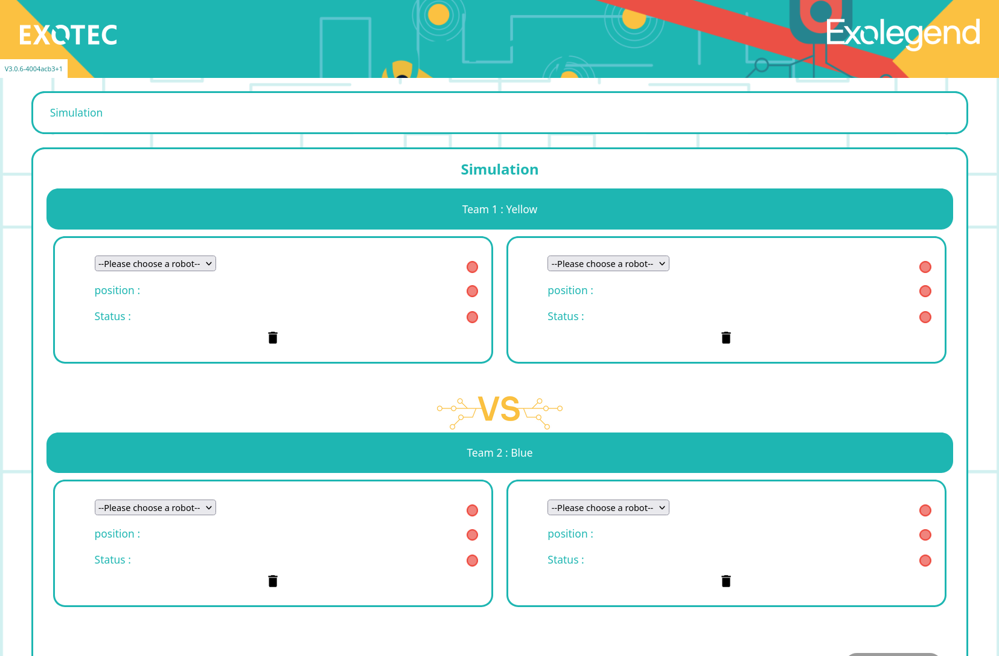

# Exolegend virtual machine

**[WARNING]** - This is not my repository. Original project was available on WeTransfer during the hackathon. This is a fork of the original work of [Exotec](https://www.exotec.com/), for Exolegend #3 hackathon.

It is available on this [link](https://we.tl/t-yn5KlpOOwT) with this password `__LeM0tDePa55eLePlusS1mpleDuM0nde_!!!!!_;)`.

---

## Overview 

The Exolegend Virtual Machine simulates the gameplay environment for **Exolegend #3**, a game where the goal is to color as many grid cells as possible using bombs, while avoiding detonation on the player’s own position.

This repository contains the necessary files to run the virtual machine and launch the associated game simulation. 


## Example Robots:
- [Sentience Beta](https://github.com/Sentience-Robotics/exolegend-beta)


## Prerequisites

- PlatformIO: Ensure that PlatformIO is installed in your environment to compile and run the programs. PlatformIO is used to manage the build and launch of the client.


## Installation & Usage
### 1. Unzip `binaries.zip` 
Unzip the `binaries.zip` file that comes with this repository. The binaries are necessary for launching and running the virtual machine and the game client.
```bash
unzip binaries.zip
```

### 2. Launch virtual machine
Once the binaries are extracted, you can launch the virtual machine with the following command. This will open the web interface of the simulator.
```bash
./launch_virtual.sh
```
Once this script is run, the simulation should be accessible via your web browser.

### 3. Stopping the Virtual Machine
If you need to stop the virtual machine at any time, simply use the following command to kill the process.
```bash
./kill_virtual.sh
```

### 4. Launching Robots
Any robots can be launched using `./ghost.sh` in their directories alongside this server. This script will start the robot's AI and connect it to the virtual machine.

```bash
cd path/to/robot_directory
./ghost.sh
```


## Images

### Game Master


## Useful links

- [Exolegend](https://www.exolegend.com/)
- [Gitlab](https://gitlab.com/exolegend/exolegend)